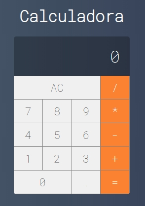

## Calculadora - React

Projeto desenvolvido durante o curso de React

## Rodando a aplicação

- Link do projeto: `https://github.com/WilliamWJD/Calculadora-React.git`
- Acesse o diretório do projeto pelo terminal
- Instalando as dependências: `yarn`
- Rodando o projeto: `yarn start`

## Autor

William José Dias [Git](https://github.com/WilliamWJD)
